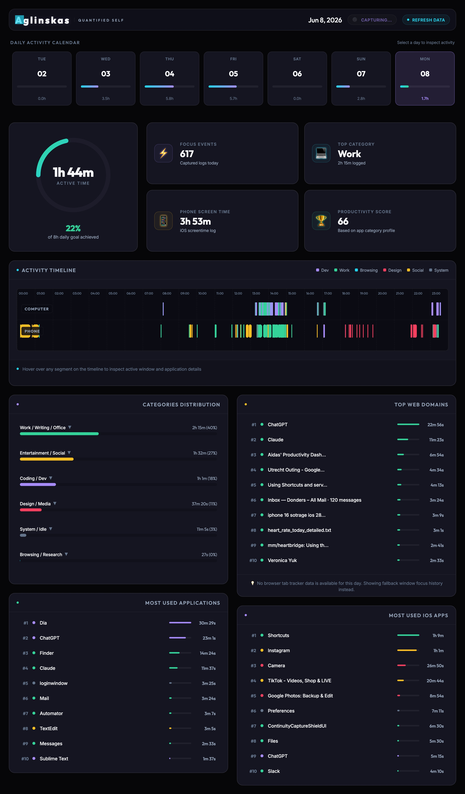

# Quantified Self Dashboard

Vibe coded personal productivity and quantified-self dashboard. It integrates desktop activity tracking (via ActivityWatch) and mobile screen-time logs (via iOS ScreenTime exports) into a unified, interactive user interface.

## Dashboard Preview



---

## Core Features

1.  **Multi-Device Synchronization**: Integrates logs from both your primary Computer (Active Window & Web Tab tracking) and iPhone (Screen Time app categorization).
2.  **Daily Activity Calendar**: A top horizontal selector strip showing daily spark-bar levels representing relative focus durations for each day.
3.  **Hero Goal Tracking**: Displays active time against an 8-hour daily goal using a glowing circular SVG progress ring and dynamically computes a weighted Productivity Score.
4.  **24-Hour Interactive Timeline**: Parallel lanes visualising Computer and Phone usage. Supports:
    *   **Smooth Hover Inspection**: Hovering over any segment reveals exact duration, application name, category, and window titles/websites.
    *   **Drag-to-Zoom Selection**: Click-and-drag over any interval to zoom in on micro-activities.
    *   **Scroll-driven Zoom**: Center-focused trackpad scrolling for zooming in and out.
5.  **Granular Analytics**: Categorized lists showing focus time distribution across core categories, top desktop applications, top iOS apps, and most visited browser domains.
6.  **Drill-down Modals**: Click on any app or website list item to launch an overlay dialog containing chronological log entries (time ranges, window titles, URLs).
7.  **Dynamic Ingestion & Sync**: Refresh and pull new logs from local servers and device databases at the click of a button.
8.  **Offline Capture**: High-fidelity DOM screenshot capture capability that writes directly to the server.

---

## System Architecture & Data Flow

The project follows a lightweight client-server model designed to run entirely locally without external data leaks.

```mermaid
graph TD
    subgraph Data Sources
        AW[ActivityWatch Local API]
        ST[aw-import-screentime DB]
    end

    subgraph Backend Pipeline [server.py]
        AW_JSON[activity_watch_data.json]
        ST_JSON[iphone_screentime.json]
        CSV_Conv[CSV Converters]
        CSV_Files[Daily CSV Shards]
        Data_Engine[Timeline Sweep / Aggregator]
        HTTPServer[Custom HTTPServer]
    end

    subgraph Frontend Client [public/]
        HTML[index.html]
        CSS[style.css]
        JS[app.js]
    end

    AW -->|Fetch API /api/refresh| AW_JSON
    ST -->|aw-import-screentime export| ST_JSON
    AW_JSON --> CSV_Conv
    ST_JSON --> CSV_Conv
    CSV_Conv -->|Split by Date| CSV_Files
    CSV_Files -->|Process Spans| Data_Engine
    Data_Engine -->|In-Memory Cache| HTTPServer
    HTTPServer -->|Serve REST APIs & Assets| Frontend Client
```

### Ingest & Pre-processing
*   **Ingestion**: Desktop activity is fetched from ActivityWatch's local API (`http://localhost:5600`). iPhone data is pulled via the `aw-import-screentime` sync command.
*   **Conversion**: Script files `convert_AW_to_csv.py` and `convert_iphone_to_csv.py` translate these JSON exports into raw CSV tables.
*   **Daily Sharding**: The CSV files are split chronologically into directory shards under `Data/data_timeline/[YEAR-MONTH-DAY]/` (e.g. `2026-06-08`).

### Core Timeline Intersection Algorithm (Desktop)
To ensure idle/AFK states are accounted for, `server.py` implements a two-pointer sweep algorithm to find active windows:
1.  Loads the AFK logs and filters out spans where the user is active (`not-afk`).
2.  Loads window focus events.
3.  Sweeps through both sorted event arrays, producing intersection spans where a window event overlaps with an active (`not-afk`) state.
4.  Optionally correlates window spans with Chrome/Safari web tab URLs that intersect with the window display interval.

---

## Technical Stack

### Backend
*   **Runtime**: Python 3
*   **Server**: Built-in standard `http.server.HTTPServer` (no external dependencies like Flask/FastAPI required).
*   **Data Manipulation**: `json`, `csv`, `datetime`, `urllib.request`, and `subprocess`.

### Frontend
*   **Structure**: Semantic HTML5 with modal `<dialog>` elements.
*   **Styles**: Modern dark glassmorphism built with Vanilla CSS. Uses absolute positioning, HSL/RGBA coloring, radial background glows, blur backdrops, and interactive flex layouts.
*   **Logic**: Vanilla JavaScript (ES6) handling all state (selected dates, zoom factors, selection coordinates), dynamic DOM mutations, timeline layout rendering, and REST fetch calls.
*   **External Library**: `html2canvas.min.js` (loaded via CDN) is used for rendering the screenshot image.

---

## API Documentation

The server exposes the following HTTP endpoints:

### 1. Serve Static Assets
*   `GET /` $\rightarrow$ Serves `public/index.html`
*   `GET /style.css` $\rightarrow$ Serves `public/style.css`
*   `GET /app.js` $\rightarrow$ Serves `public/app.js`

### 2. Get Summary Data
*   **Endpoint**: `GET /api/summary`
*   **Description**: Returns metadata for the calendar strip, representing daily active time and categories.
*   **Response JSON**:
    ```json
    {
      "days": {
        "2026-06-08": {
          "active_seconds": 6264.0,
          "iphone_active_seconds": 14004.0,
          "events_count": 482,
          "categories": { "Coding / Dev": 1200.0, "Browsing / Research": 5064.0 }
        }
      },
      "latest_date": "2026-06-08",
      "categories_meta": { "Coding / Dev": "#a78bfa", ... }
    }
    ```

### 3. Get Selected Day Detail
*   **Endpoint**: `GET /api/day?date=YYYY-MM-DD`
*   **Description**: Retrieves the full activity logs, categorized timeline event blocks, top applications, and domains for the chosen date.
*   **Response JSON**:
    ```json
    {
      "date": "2026-06-08",
      "active_seconds": 6264.0,
      "iphone_active_seconds": 14004.0,
      "timeline": [
        {
          "start": "2026-06-08T09:30:00+02:00",
          "end": "2026-06-08T09:45:00+02:00",
          "duration": 900.0,
          "app": "Cursor",
          "title": "server.py - editing README",
          "url": "",
          "web_title": "",
          "category": "Coding / Dev",
          "color": "#a78bfa",
          "host": "MacBook"
        }
      ],
      "iphone_timeline": [...],
      "categories": { "Coding / Dev": { "seconds": 1200, "color": "#a78bfa" } },
      "top_apps": [...],
      "top_ios_apps": [...],
      "top_domains": [...]
    }
    ```

### 4. Trigger Sync Refresh
*   **Endpoint**: `POST /api/refresh`
*   **Description**: Executes sync processes for requested sources (computer and/or iphone).
*   **Payload JSON**:
    ```json
    { "computer": true, "iphone": false }
    ```
*   **Response JSON**:
    ```json
    { "status": "success", "results": { "computer": { "status": "done" } } }
    ```

### 5. Save Dashboard Capture
*   **Endpoint**: `POST /api/save-screenshot`
*   **Description**: Accepts a base64 encoded JPG data url representing a screenshot of the dashboard, decodes it, and overwrites the local `dashboard_capture.jpg` file in the root workspace.
*   **Payload JSON**:
    ```json
    { "image": "data:image/jpeg;base64,..." }
    ```
*   **Response JSON**:
    ```json
    { "status": "success", "path": "dashboard_capture.jpg" }
    ```

---

## Getting Started

### Prerequisites
*   Python 3.x
*   (Optional) A local [ActivityWatch](https://activitywatch.net/) instance running and tracking data.
*   (Optional) An initialized `aw-import-screentime` sync workspace configured to read Screen Time backups.

### Running the Application
To run the server and open the web dashboard:
```bash
# Execute the startup shell script
chmod +x run.sh
./run.sh
```
This starts the backend on port `8000` and automatically opens `http://localhost:8000` in your default browser.

---

## Development Notes for AI and Engineers

If you are a developer or an AI picking up this repository, keep in mind these implementation patterns:

### 1. Screenshot Capture Overrides
`html2canvas` fails to render elements with a gradient background that compute to a width or height of `0px` (or sub-pixels rounding down to zero), throwing `InvalidStateError` when trying to call `createPattern` with a `0x0` canvas. 

To bypass this without breaking visual styles:
*   Before calling `html2canvas`, **app.js** scans the DOM and checks `offsetWidth/offsetHeight` of all elements. If they have a background gradient and are zero-sized, it sets their background image to `none !important`. These are restored immediately after capture.
*   Additionally, because `html2canvas` does not support `backdrop-filter: blur()`, transparent cards show up as pitch black in the capture image. To prevent this, a stylesheet override is injected into the **cloned document** in the `onclone` callback, giving `.card`, `.app-header` and `.calendar-day-item` solid backgrounds (`rgba(22, 22, 35, 0.95)`) to replicate the bright glassmorphism design.
*   Animations and transitions are forced to `none !important` inside the `onclone` callback to guarantee elements aren't captured at intermediate opacities during transition cycles.

### 2. Time Operations
Local timezone conversions are handled automatically in `server.py` using `datetime.fromisoformat` and system `astimezone()` info. This is critical for matching timestamps from iPhone datasets (which default to UTC) with local computer timelines.

### 3. CSS Conventions
*   Avoid adding ad-hoc framework grids. Layout flows are powered strictly by custom Vanilla CSS variables (e.g. `--bg-base`, `--clr-dev`, `--text-primary`), enabling dark-mode consistency.
*   Visual components rely heavily on modern structural tags (`<dialog>`, `<header>`, `<main>`, `<section>`).
